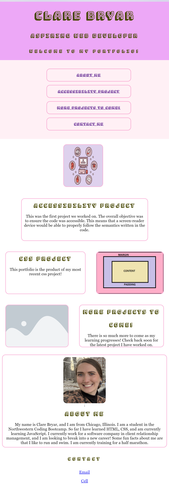

# 02-portfolio-project
#Description 
This portfolio project was completed using the CSS tools learned in the past week. This page features past projects, with a link to the current deployed work. As well as an about me section. In working on this project I learned about different CSS elements like flexbox to arrange items on a page. I also learned about how to adjust styling to ensure a smooth user experience on any size of device. 

#Usage
This page is currently housing my portfolio of work completed thus far. As the course progresses I can use this page to deposit more finished work, and continue to develop the style on the portfolio. 

Link to deployed page: 
